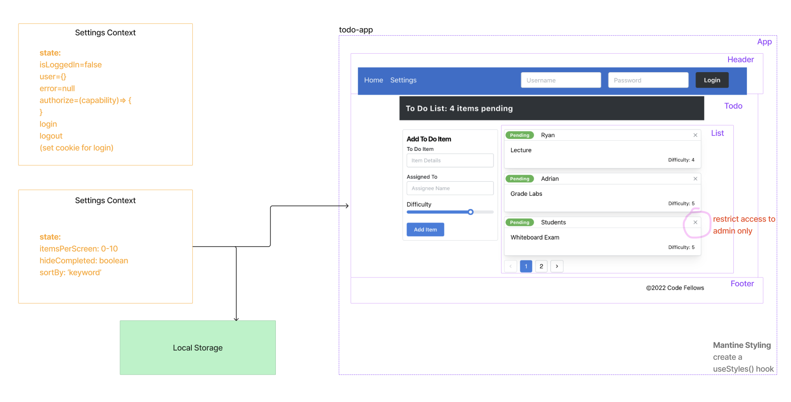

# LAB - Class 33

## Project: <Login /> and <Auth /> | To Do List Manager

### Author: Heather Holcomb | 401d53

***

### Problem Domain

A Web Application for securely managing a To Do List.

### Links and Resources

- [GitHub Actions ci/cd](https://github.com/holcombheather/todo-app/actions)
- [Deployed link on codesandbox.io](https://codesandbox.io/p/github/holcombheather/todo-app/auth?file=%2FREADME.md&layout=%257B%2522sidebarPanel%2522%253A%2522EXPLORER%2522%252C%2522rootPanelGroup%2522%253A%257B%2522direction%2522%253A%2522horizontal%2522%252C%2522type%2522%253A%2522PANEL_GROUP%2522%252C%2522id%2522%253A%2522ROOT_LAYOUT%2522%252C%2522panels%2522%253A%255B%257B%2522type%2522%253A%2522PANEL_GROUP%2522%252C%2522direction%2522%253A%2522horizontal%2522%252C%2522id%2522%253A%2522EDITOR%2522%252C%2522panels%2522%253A%255B%257B%2522type%2522%253A%2522PANEL%2522%252C%2522panelType%2522%253A%2522TABS%2522%252C%2522id%2522%253A%2522clji9tksn009f3b6mg2xsxpoa%2522%257D%255D%252C%2522sizes%2522%253A%255B100%255D%257D%252C%257B%2522type%2522%253A%2522PANEL_GROUP%2522%252C%2522direction%2522%253A%2522horizontal%2522%252C%2522id%2522%253A%2522DEVTOOLS%2522%252C%2522panels%2522%253A%255B%257B%2522type%2522%253A%2522PANEL%2522%252C%2522panelType%2522%253A%2522TABS%2522%252C%2522id%2522%253A%2522clji9tksn009h3b6m5oaftn16%2522%257D%255D%252C%2522sizes%2522%253A%255B100%255D%257D%255D%252C%2522sizes%2522%253A%255B50%252C50%255D%257D%252C%2522tabbedPanels%2522%253A%257B%2522clji9tksn009f3b6mg2xsxpoa%2522%253A%257B%2522tabs%2522%253A%255B%257B%2522id%2522%253A%2522clji9tksn009e3b6mulg4kaez%2522%252C%2522mode%2522%253A%2522permanent%2522%252C%2522type%2522%253A%2522FILE%2522%252C%2522filepath%2522%253A%2522%252FREADME.md%2522%257D%255D%252C%2522id%2522%253A%2522clji9tksn009f3b6mg2xsxpoa%2522%252C%2522activeTabId%2522%253A%2522clji9tksn009e3b6mulg4kaez%2522%257D%252C%2522clji9tksn009h3b6m5oaftn16%2522%253A%257B%2522tabs%2522%253A%255B%257B%2522id%2522%253A%2522clji9tksn009g3b6mqq2tlfab%2522%252C%2522mode%2522%253A%2522permanent%2522%252C%2522type%2522%253A%2522TASK_PORT%2522%252C%2522taskId%2522%253A%2522start%2522%252C%2522port%2522%253A3000%252C%2522path%2522%253A%2522%252F%2522%257D%255D%252C%2522id%2522%253A%2522clji9tksn009h3b6m5oaftn16%2522%252C%2522activeTabId%2522%253A%2522clji9tksn009g3b6mqq2tlfab%2522%257D%257D%252C%2522showDevtools%2522%253Atrue%252C%2522showSidebar%2522%253Atrue%252C%2522sidebarPanelSize%2522%253A15%257D)

### Collaborators

- Referenced class demo code taught by Ryan Gallaway.
- Used AI to provide additional information about cookies and to help in test development. 

***

### Setup

1. Clone this repo into your local environment
2. `npm i`
3. `npm start`

#### `.env` requirements (where applicable)

- `PORT` - 3001
- `DATABASE_URL` - see `.env.sample`

#### How to initialize/run your application (where applicable)

- `npm start` or `nodemon`

#### How to use your library (where applicable)

- N/A

***

### Features: Phase 3 Requirements

# Phase 3

In Phase 3, we’d like to extend the functionality of the application by requiring users be logged in to view items and also restrict access based on user type. The user stories from Phases 1, and 2 remain unchanged. For this phase, we are now adding the following new user stories.

## New User Stories

1. As a user, I want to provide a way for other users to create new accounts.
2. As a user, I want to provide a way for all users to login to their account.
3. As a user, I want to make sure that my To Do items are only viewable to users that have logged in with a valid account.
4. As a user, I want to ensure that only fellow users that are allowed to “create”, based on their user type, can add new To Do Items.
5. As a user, I want to ensure that only fellow users that are allowed to “update”, based on their user type, can mark To Do Items complete.
6. As a user, I want to ensure that only fellow users that are allowed to “delete”, based on their user type, can delete new To Do Items.

---

#### Tests

- `npm test`

#### UML

