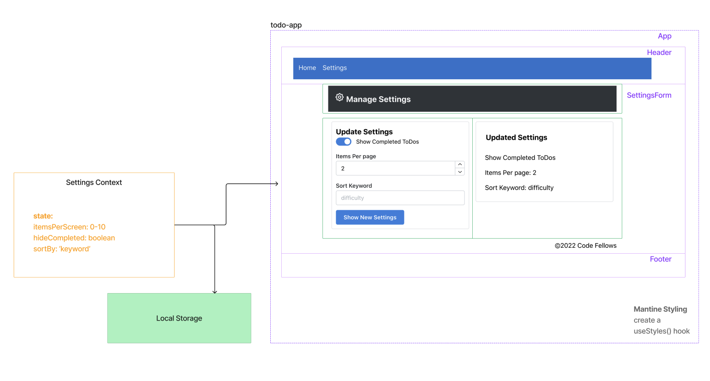

# LAB - Class 32

## Project: Context API - Behaviors | To Do List Manager

### Author: Heather Holcomb | 401d53

***

### Problem Domain

A Web Application for securely managing a To Do List.

### Links and Resources

- [GitHub Actions ci/cd](https://github.com/holcombheather/todo-app/actions)
- [Deployed link on codesandbox.io](https://codesandbox.io/p/github/holcombheather/todo-app/main?file=%2Fpackage.json%3A1%2C1&layout=%257B%2522sidebarPanel%2522%253A%2522EXPLORER%2522%252C%2522rootPanelGroup%2522%253A%257B%2522direction%2522%253A%2522horizontal%2522%252C%2522type%2522%253A%2522PANEL_GROUP%2522%252C%2522id%2522%253A%2522ROOT_LAYOUT%2522%252C%2522panels%2522%253A%255B%257B%2522type%2522%253A%2522PANEL_GROUP%2522%252C%2522direction%2522%253A%2522horizontal%2522%252C%2522id%2522%253A%2522EDITOR%2522%252C%2522panels%2522%253A%255B%257B%2522type%2522%253A%2522PANEL%2522%252C%2522panelType%2522%253A%2522TABS%2522%252C%2522id%2522%253A%2522cljfca7yc000b3b6mbtal4614%2522%257D%255D%252C%2522sizes%2522%253A%255B100%255D%257D%252C%257B%2522type%2522%253A%2522PANEL_GROUP%2522%252C%2522direction%2522%253A%2522horizontal%2522%252C%2522id%2522%253A%2522DEVTOOLS%2522%252C%2522panels%2522%253A%255B%257B%2522type%2522%253A%2522PANEL%2522%252C%2522panelType%2522%253A%2522TABS%2522%252C%2522id%2522%253A%2522cljfca7yc000d3b6muygueo12%2522%257D%255D%252C%2522sizes%2522%253A%255B100%255D%257D%255D%252C%2522sizes%2522%253A%255B50%252C50%255D%257D%252C%2522tabbedPanels%2522%253A%257B%2522cljfca7yc000b3b6mbtal4614%2522%253A%257B%2522tabs%2522%253A%255B%257B%2522id%2522%253A%2522cljfca7yc000a3b6mmqw6e02n%2522%252C%2522mode%2522%253A%2522permanent%2522%252C%2522type%2522%253A%2522FILE%2522%252C%2522filepath%2522%253A%2522%252FREADME.md%2522%252C%2522state%2522%253A%2522IDLE%2522%257D%252C%257B%2522id%2522%253A%2522cljginvk3008h3b6m01ir33qd%2522%252C%2522mode%2522%253A%2522permanent%2522%252C%2522type%2522%253A%2522FILE%2522%252C%2522filepath%2522%253A%2522%252Fpackage.json%2522%252C%2522state%2522%253A%2522IDLE%2522%257D%255D%252C%2522id%2522%253A%2522cljfca7yc000b3b6mbtal4614%2522%252C%2522activeTabId%2522%253A%2522cljginvk3008h3b6m01ir33qd%2522%257D%252C%2522cljfca7yc000d3b6muygueo12%2522%253A%257B%2522tabs%2522%253A%255B%257B%2522id%2522%253A%2522cljfcc35k011a3b6m17mur0bg%2522%252C%2522mode%2522%253A%2522permanent%2522%252C%2522type%2522%253A%2522EMPTY_DEVTOOL%2522%257D%255D%252C%2522id%2522%253A%2522cljfca7yc000d3b6muygueo12%2522%252C%2522activeTabId%2522%253A%2522cljfcc35k011a3b6m17mur0bg%2522%257D%257D%252C%2522showDevtools%2522%253Atrue%252C%2522showSidebar%2522%253Atrue%252C%2522sidebarPanelSize%2522%253A15%257D)

### Collaborators

- Referenced class demo code taught by Ryan Gallaway

***

### Setup

1. Clone this repo into your local environment
2. `npm i`
3. `npm start`

#### `.env` requirements (where applicable)

- `PORT` - 3001
- `DATABASE_URL` - see `.env.sample`

#### How to initialize/run your application (where applicable)

- `npm start` or `nodemon`

#### How to use your library (where applicable)

- N/A

***

### Features: Phase 2 Requirements

In Phase 2, we’re going to extend the functionality of our application by allowing the user to make some decisions on how they would like the application to function. Specifically, we’ll let them make changes to 2 settings.

1. **Implement the Context API** to make some basic application settings available to components.

   - How many To Do Items to show at once.
   - Whether or not to show completed items.
   
   *Hint: if reusing the custom useForm() hook, event validation may be necessary if using any Mantine component other than `<TextInput />`.*

2. **Provide the users with a form** where they can change the values for those settings.

   - This should be given in the form of a new component, perhaps linked to from the main navigation.
   
   *Hint: Use Browser Router to create the page/route/component for this.*

3. **Render the updated settings** to the right of the "form". Consider using `<Grid />`, `<Card />`, and `<When />` components once settings are updated.

4. **Save the users choices in Local Storage**.

5. **Retrieve their preferences from Local Storage** and apply them to the application on startup.

#### Tests

- `npm test`

#### UML

