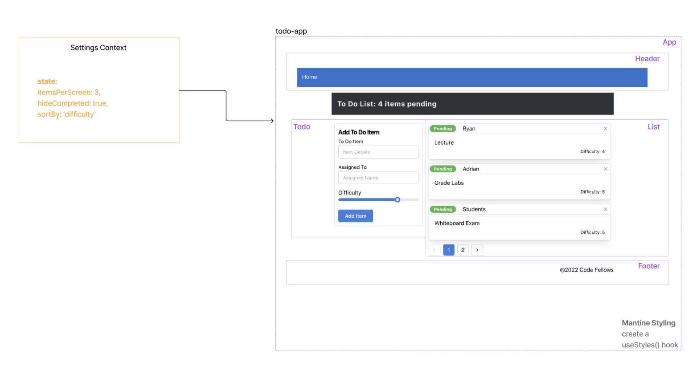

# LAB - Class 31

## Project: Context API - To Do List Manager

### Author: Heather Holcomb | 401d53

***

### Problem Domain

A Web Application for securely managing a To Do List.

### Links and Resources

- [GitHub Actions ci/cd](https://github.com/holcombheather/todo-app/actions)
- [Deployed link on codesandbox.io](https://codesandbox.io/p/github/holcombheather/todo-app/context-settings?layout=%257B%2522sidebarPanel%2522%253A%2522EXPLORER%2522%252C%2522rootPanelGroup%2522%253A%257B%2522direction%2522%253A%2522horizontal%2522%252C%2522type%2522%253A%2522PANEL_GROUP%2522%252C%2522id%2522%253A%2522ROOT_LAYOUT%2522%252C%2522panels%2522%253A%255B%257B%2522type%2522%253A%2522PANEL_GROUP%2522%252C%2522direction%2522%253A%2522horizontal%2522%252C%2522id%2522%253A%2522EDITOR%2522%252C%2522panels%2522%253A%255B%257B%2522type%2522%253A%2522PANEL%2522%252C%2522panelType%2522%253A%2522TABS%2522%252C%2522id%2522%253A%2522cljfcajct00bl3b6ms6lx54yr%2522%257D%255D%252C%2522sizes%2522%253A%255B100%255D%257D%252C%257B%2522type%2522%253A%2522PANEL_GROUP%2522%252C%2522direction%2522%253A%2522horizontal%2522%252C%2522id%2522%253A%2522DEVTOOLS%2522%252C%2522panels%2522%253A%255B%257B%2522type%2522%253A%2522PANEL%2522%252C%2522panelType%2522%253A%2522TABS%2522%252C%2522id%2522%253A%2522cljfcajct00bn3b6moqig2kzl%2522%257D%255D%252C%2522sizes%2522%253A%255B100%255D%257D%255D%252C%2522sizes%2522%253A%255B37.34828241876984%252C62.65171758123016%255D%257D%252C%2522tabbedPanels%2522%253A%257B%2522cljfcajct00bl3b6ms6lx54yr%2522%253A%257B%2522id%2522%253A%2522cljfcajct00bl3b6ms6lx54yr%2522%252C%2522activeTabId%2522%253A%2522cljfcfhb901m33b6mi7b3wgzt%2522%252C%2522tabs%2522%253A%255B%257B%2522id%2522%253A%2522cljfcajcs00bk3b6m0qh566x4%2522%252C%2522mode%2522%253A%2522permanent%2522%252C%2522type%2522%253A%2522FILE%2522%252C%2522filepath%2522%253A%2522%252FREADME.md%2522%252C%2522state%2522%253A%2522IDLE%2522%257D%252C%257B%2522type%2522%253A%2522FILE%2522%252C%2522filepath%2522%253A%2522%252F.codesandbox%252Ftasks.json%2522%252C%2522id%2522%253A%2522cljfcehwk01h03b6mflurz2yl%2522%252C%2522mode%2522%253A%2522permanent%2522%257D%252C%257B%2522type%2522%253A%2522FILE%2522%252C%2522filepath%2522%253A%2522%252Fpackage.json%2522%252C%2522id%2522%253A%2522cljfcfhb901m33b6mi7b3wgzt%2522%252C%2522mode%2522%253A%2522temporary%2522%257D%255D%257D%252C%2522cljfcajct00bn3b6moqig2kzl%2522%253A%257B%2522id%2522%253A%2522cljfcajct00bn3b6moqig2kzl%2522%252C%2522activeTabId%2522%253A%2522cljfcb7um00oq3b6m6i878asl%2522%252C%2522tabs%2522%253A%255B%257B%2522type%2522%253A%2522TASK_LOG%2522%252C%2522taskId%2522%253A%2522start%2522%252C%2522id%2522%253A%2522cljfcb2hy00j13b6mel8rrx1t%2522%252C%2522mode%2522%253A%2522permanent%2522%257D%252C%257B%2522type%2522%253A%2522TASK_PORT%2522%252C%2522taskId%2522%253A%2522start%2522%252C%2522port%2522%253A3000%252C%2522id%2522%253A%2522cljfcb7um00oq3b6m6i878asl%2522%252C%2522mode%2522%253A%2522permanent%2522%252C%2522path%2522%253A%2522https%253A%252F%252Fshhmf9-3000.csb.app%252F%2522%257D%252C%257B%2522id%2522%253A%2522cljfcfwdy01oi3b6m1bkf19uc%2522%252C%2522mode%2522%253A%2522permanent%2522%252C%2522type%2522%253A%2522TERMINAL%2522%252C%2522shellId%2522%253A%2522cljfcfwhg001gfnftazm6aim1%2522%257D%252C%257B%2522type%2522%253A%2522UNASSIGNED_PORT%2522%252C%2522port%2522%253A3001%252C%2522id%2522%253A%2522cljfcgvaw01s93b6m0sd7c9so%2522%252C%2522mode%2522%253A%2522permanent%2522%252C%2522path%2522%253A%2522%2522%257D%255D%257D%257D%252C%2522showDevtools%2522%253Atrue%252C%2522showSidebar%2522%253Atrue%252C%2522sidebarPanelSize%2522%253A15%257D)

### Collaborators

- Referenced class demo code taught by Ryan Gallaway

***

### Setup

1. Clone this repo into your local environment
2. `npm i`
3. `npm start`

#### `.env` requirements (where applicable)

- `PORT` - 3001
- `DATABASE_URL` - see `.env.sample`

#### How to initialize/run your application (where applicable)

- `npm start` or `nodemon`

#### How to use your library (where applicable)

- N/A

***

### Features: Phase 1 Requirements

In Phase 1, we're going to perform some refactoring of a Todo application built by another team. This application mixes application state and user settings at the top level and passes things around. It was a good proof of concept, but we need to make this production ready.
  1. Create a Detailed UML.

  2. Properly modularize the application into separate components, note the proposed file structure below.

  3. Implement the Context API to make some basic application settings available to components.

    - Show three items by default.
    - Hide completed items by default.
    - Add the sort word 'difficulty' by default.

  4. Style the application using the [Mantine Component API](https://mantine.dev/).

#### Tests

- `npm test`

#### UML

